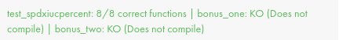

<p align="center">
  
</p>
<h3 align="center">
  <em>Because ft_putnbr() and ft_putstr() aren’t enough</em>
</h3>

---

## ⚠️ Disclaimer

- **Full Portfolio:** This repository focuses on this specific project. You can find my entire 42 curriculum 👉 [here](https://github.com/Overtekk/42).
- **Subject Rules:** I strictly follow the rules regarding 42 subjects; I cannot share the PDFs, but I explain the concepts in this README.
- **Archive State:** The code is preserved exactly as it was during evaluation (graded state). I do not update it, so you can see my progress and mistakes from that time.
- **Academic Integrity:** I encourage you to try the project yourself first. Use this repo only as a reference, not for copy-pasting. Be patient, you will succeed.

## 📂 Purpose

The goal of this project is to recreate the famous `printf` function from the C standard library.

This project introduces a key concept in C programming: **Variadic Functions**. It teaches us how to handle a function that accepts an indefinite number of arguments using `<stdarg.h>`.
Instead of manually calling `write` or `ft_putstr` multiple times for different types of data, `ft_printf` allows us to format and print various data types in a single function call.

**📦 Library Integration:**
We are allowed to use our `libft` in this project. However, it must be compiled using its own `Makefile`. This challenges us to understand how to **link external libraries** and manage **nested compilations** (calling a Makefile from another).

## 🐨 Status

Completed on **06/11/2025** without bonus.
<p align="left">
  
  &nbsp;&nbsp;
  
</p>

## 🔷 Usage

- First, clone this repository.

`make` to compile mandatory functions.

I have provided a complete `main` to test your ft_printf. You can run it using this command:\
```cc -Wall -Werror -Wextra main/main.c libftprintf.a && ./a.out```\
Press `enter` to test all conversion.

## 🛠️ Supported Conversions

This implementation supports the following standard conversions:

| Conversion | Description |
| :---: | :--- |
| `%c` | Prints a single character. |
| `%s` | Prints a string (as defined by the common C convention). |
| `%p` | The `void *` pointer argument has to be printed in hexadecimal format. |
| `%d` | Prints a decimal number (base 10). |
| `%i` | Prints an integer in base 10. |
| `%u` | Prints an unsigned decimal (base 10) number. |
| `%x` | Prints a number in hexadecimal (base 16) lowercase format. |
| `%X` | Prints a number in hexadecimal (base 16) uppercase format. |
| `%%` | Prints a percent sign. |

---
